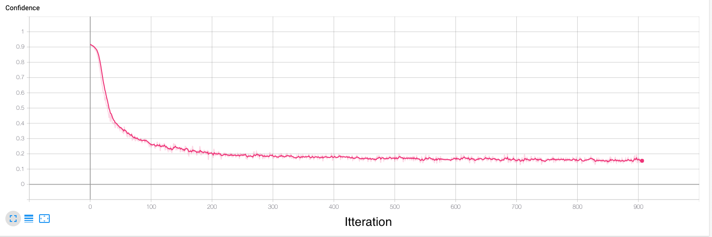
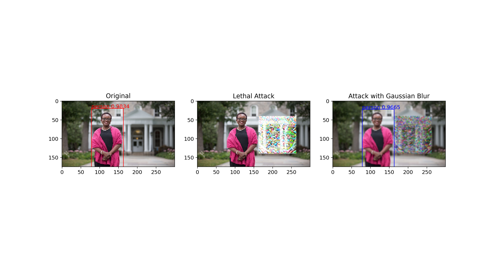
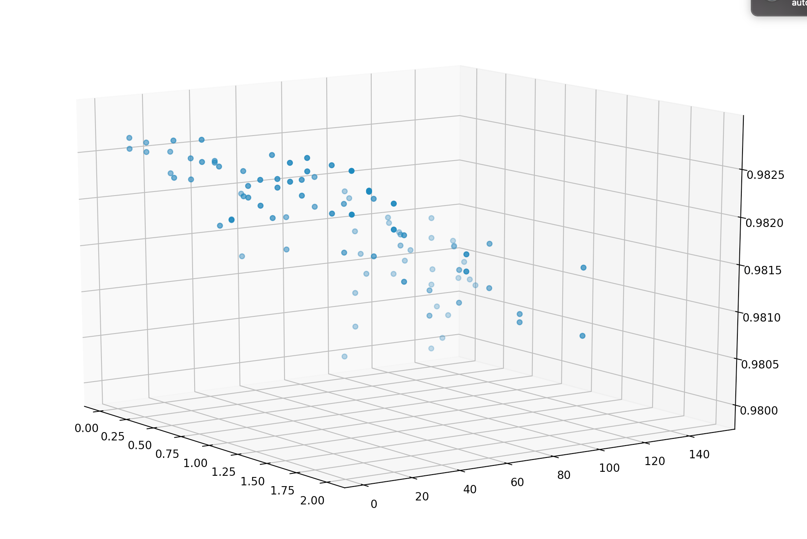
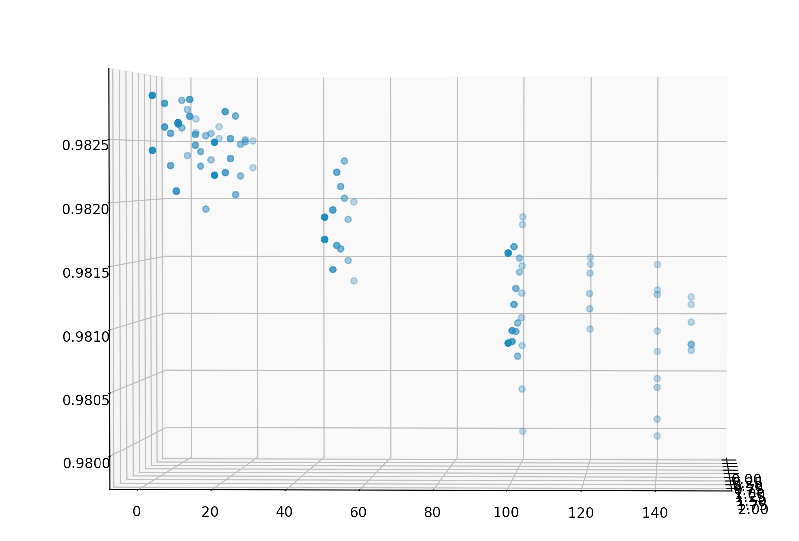

# ***Developing Patch Based Adversarial Attacks***

This repository contains python code to generate, evaluate, and visualize a patch based adversarial attack for the Yolov3 object detector, a copy of which is included  here. Some of the code in this repository has been pulled directly from other repositories, as cited in my research report.

This is the code associated with my research, funded by the SOAR-NSE undergraduate research program at Swarthmore College.

## *About the Repository*
- The requirements.txt file contains a listing of all required packages
- The script adversarial_attack.py is the adversarial attack generator 
- The config.gin file contains the options for adversarial_attack.py 
- The data directory contains training data
- The results directory contains results from past trainings and will be populated as adversarial_attack.py is run
- The tf_logs directory is set up for tensorboard logging
- The yolov3 directory contains the yolov3 object detector that is attacked.

## Adversarial Patch

<p align="center">
  
</p>

 


---

## Hardware
This code supports multi-threading and is both cpu and gpu compatable. In config.gin specify 'cpu' to run on a cpu, 'cuda' to run on any available gpu or 'cuda:[gpu number]' to run on a specific gpu.
The code runs on macOS and linux.

## Requirements

Python 3.7 or later with all `requirements.txt` dependencies installed. To install all dependencies run:
```bash
$ pip install -U -r requirements.txt
```

## Patch Training
- Set the main logic command in config.gin to 'train'
- Set optional configuration options in config.gin
```bash
$ python adversarial_attack.py config.gin
```



## Patch Visualization
- Set the main logic command in config.gin to 'visualize'
- Set optional configuration options in config.gin
```bash
$ python adversarial_attack.py config.gin
```


## Patch Evaluation
- Set the main logic command in config.gin to 'evaluate'
- Set the secondary evaluation logic command if desired
- Set optional configuration options in config.gin
```bash
$ python adversarial_attack.py config.gin
```
## Hyperparameter Optimization
- Set the main logic command in config.gin to 'optimize'
- Set the optimization parameters in config.gin
```bash
$ python adversarial_attack.py config.gin
```
  

## Questions
 Got questions? Email me at ianmcdiarmidsterling at gmail dot com

## License

[](http://badges.mit-license.org)

- **[MIT license](http://opensource.org/licenses/mit-license.php)**

## Acknowledgments
Special thank you for discussion, guidance, and support to:
- Professor Allan Moser 
- David Sterling PhD 


Thank you to all grant donors at Swarthmore College making undergraduate research possible.
