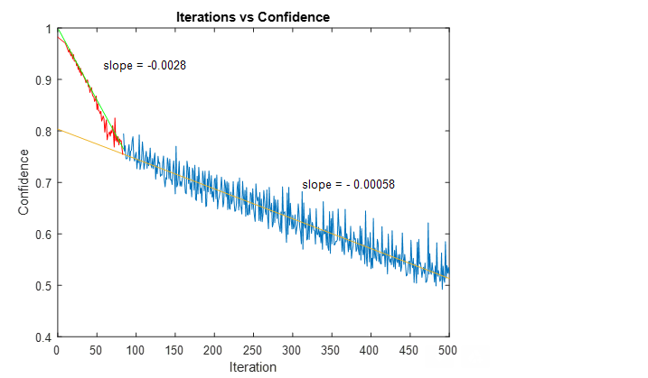

# *Developing Patch Based Adversarial Attacks*
## Ian McDiarmid-Sterling
##### Swarthmore College
##### 14 August, 2020

This repository allows one to generate, evaluate, and visualize a patch based adversarial attack for the Yolov3 object detector, a copy of which is included in this repository. Some of the code in this repository has been pulled directly from other repositories, as cited in my research report.

This is the code associated with my research, generated with funding from Swarthmore College's SOAR-NSE undergraduate research program, and with assistance from Profesor Allan Moser.


**About the Repository**
- The requirements.txt file contains all the modules that are needed for the scripts
- The script adversarial_attack.py is the adversarial attack generator and must be called with the config.gin file when run
- The config.gin file contains the options for adversarial_attack.py 
- The data directory contains training data
- The results directory contains results from past runs and will be populated as adversarial_attack.py is run
- The tf_logs directory is setup for tensorboard logging
- The yolov3 directory contains the yolov3 object detector that is attacked.

## Adversarial Patch


--- 


### Installation


## Requirements

Python 3.7 or later with all `requirements.txt` dependencies installed. To install all dependencies run:
```bash
$ pip install -U -r requirements.txt
```


- All the `code` required to get started
- Images of what it should look like

## Training
- Set the main logic command in the config.gin to 'train'
```bash
$ python adversarial_attack.py config.gin
```



## Visualization
- Set the main logic command in the config.gin to 'visualize'
```bash
$ python adversarial_attack.py config.gin
```


## Evaluation
- Set the main logic command in the config.gin to 'evaluate'
- Set the secondary logic command if desired
```bash
$ python adversarial_attack.py config.gin
```
## Hyper Parameter Optimization
- Set the main logic command in the config.gin to 'optimize'
- Set the optimization parameters in the config.gin
```bash
$ python adversarial_attack.py config.gin
```
  


## Questions?
Feel free to email me at ianmcdiarmidsterling at gmail dot com


## License

[](http://badges.mit-license.org)

- **[MIT license](http://opensource.org/licenses/mit-license.php)**

